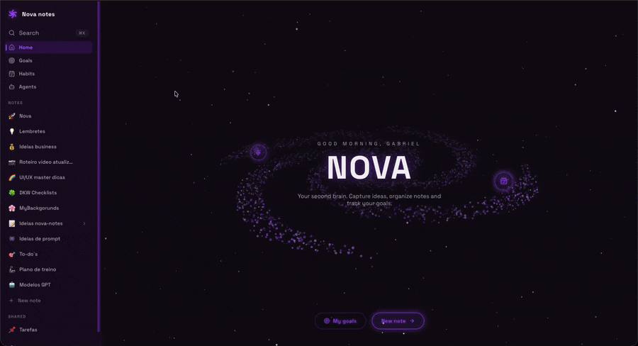

# NOVA — your personal second brain

A **personal productivity** web app (notes, goals and habits) with a spacey HUD aesthetic, multi-user and real-time in the cloud. Built from scratch in React, with a Notion-style editor, integrated AI, voice control, 3D canvas animations and a serverless Supabase backend.

🔗 **Try it live:** https://novanotes.lauxen.dev



---

## ✨ Features

**Notes — Notion-style block editor**
- Rich text editor (Tiptap) with headings, lists, to-dos, quotes, code blocks, **tables**, **dividers** and **collapsible toggles**.
- **Slash `/` menu** to insert blocks fast, Notion-style.
- **Drag handle** on every block to reorder — and a click menu to **transform** a block (turn a to-do into a heading, etc.) or delete it.
- **Sub-pages / hierarchy**: nest notes inside notes (like Notion), with a collapsible tree in the sidebar and cross-level drag.
- **Images**: drag, paste or `/image` — stored privately in Supabase Storage (signed URLs), resizable and centered.
- **Floating toolbar** on text selection (bold, italic, underline, link).
- **Links** dialog: custom text + external URL or internal link to another note (client-side navigation).
- Markdown persistence, with `.md` import/export. Tags, category emoji picker and debounced autosave.

**AI (multi-provider)**
- **Generate and rewrite notes** with AI — pick your provider (**OpenAI, Groq, Gemini, Cerebras**); if one hits its rate limit, the others take over as an automatic fallback.
- **Configurable AI agents** with their own instructions.
- Per-user API keys, stored only in your browser (never on a server).

**Voice control**
- **Record your voice to create or refactor a note** — dictate an instruction and the AI rewrites the note for you.
- **Voice transcription** (speech-to-text) powered by Groq (Whisper).
- Quick triggers: `Cmd/Ctrl + J` inside a note, or an edge-swipe gesture on mobile.

**Reminders & notifications**
- `/reminder` block that turns a to-do into a scheduled reminder (one-off, daily or every X hours).
- Per-habit notifications at a set time.
- **Self-built Web Push (VAPID)** — implemented from scratch with Web Crypto — delivered by a Supabase Edge Function + `pg_cron`, so reminders arrive **even with the app closed**, in the correct timezone.

**Goals**
- Any note can be flagged as a goal; the Goals page aggregates them with a progress bar.
- **Automatic progress** computed from the checkboxes/days ticked inside the note.
- Drag-and-drop reordering (dnd-kit) with persisted order.

**Habits & routines**
- Monthly grid with one checkbox per day for each activity.
- **Metrics and charts** for the month (completion per habit, activity per day, calendar heatmap, current streak and best streak).
- Per-habit view and note linking (clicking opens the related note).

**Sharing & collaboration**
- Share a note with another user (row-level-security backed shares); shared notes show up in their own sidebar section.

**Productivity**
- **Command palette (`Ctrl/Cmd + K`)** with global search across notes (title, content, tags) and navigation actions, plus a sidebar search button.
- Keyboard shortcuts and SPA navigation.

**Experience / UI**
- **Animated home screen**: a `<canvas>` particle field with pseudo-3D math (tilted galaxy/planet/atom/solar-system, differential rotation, perspective projection, mouse repulsion).
- **Matrix-style digital rain** and a starfield background across pages.
- **Theme engine**: pick a base color and the app derives the whole palette (background, surfaces, borders, text, highlights) via HSL; 3 typefaces and light/dark mode.
- **Internationalization (PT / EN)**: switch language in Settings; on first use the app follows your **browser language** automatically.
- **Installable PWA**, offline-first, with a service worker.
- Responsive: the sidebar becomes a drawer with a burger button on mobile.

**Account & data**
- **Email/password auth** (Supabase Auth) with a profile name.
- **Multi-user** with full data isolation via **Row Level Security** (`user_id = auth.uid()`).
- **Offline-first**: with no Supabase configured, the app runs 100% locally with the same data API.

---

## 🛠️ Stack

| Layer | Tech |
|---|---|
| Frontend | React 18, Vite, React Router |
| Editor | Tiptap (ProseMirror) + tiptap-markdown, dnd-kit |
| AI | OpenAI · Groq · Gemini · Cerebras (text) · Groq/Whisper (voice) |
| Animation | Canvas 2D (pseudo-3D), GSAP |
| Styling | CSS custom properties (dynamic HSL theme), no UI framework |
| Backend | Supabase — Postgres, Auth, Row Level Security, Storage, Edge Functions (Deno) |
| Notifications | Web Push (VAPID) via Web Crypto + `pg_cron` |
| Deploy | Vercel (SPA rewrites) |

---

## 🧠 Technical highlights

- **Self-built Web Push**: `npm:web-push` doesn't run in the Supabase edge runtime, so the whole VAPID flow (ES256 JWT, ECDH + HKDF + aes128gcm payload encryption) was implemented by hand with the Web Crypto API.
- **Multi-provider AI layer** with automatic failover between OpenAI/Groq/Gemini/Cerebras, plus configurable agents with tools.
- **Dynamic palette engine** (`src/theme/palette.js`): from a single color it generates ~20 harmonious CSS variables (HSL) that recolor the whole UI — including the canvas scene — in real time.
- **Decoupled data layer** (`src/lib/store.js`): one interface (`notesApi`, `habitsApi`, …) for two back-ends — Supabase in the cloud or local storage — switched automatically by configuration.
- **Pseudo-3D rendering on a 2D canvas**: disk-axis rotation, tilt, perspective projection and depth (size/brightness), no WebGL.
- **Multi-tenant security**: Postgres RLS policies ensure each user only reads their own rows, using the publishable key on the frontend.

---

## 🚀 Running locally

```bash
npm install
npm run dev
```

Opens at `http://localhost:5173`. With no config, it already works in **local mode** (data in the browser).

### Connecting Supabase (cloud + login)

1. Create a free project at [supabase.com](https://supabase.com).
2. **SQL Editor → New query**, paste `supabase_schema.sql` and run it (creates tables, columns, RLS, storage).
3. **Authentication → Providers:** enable **Email** (and, for testing, disable *Confirm email*).
4. **Project Settings → API:** copy the **Project URL** and the **Publishable key** (`sb_publishable_…`).
5. Copy `.env.example` to `.env`:

   ```
   VITE_SUPABASE_URL=https://your-project.supabase.co
   VITE_SUPABASE_PUBLISHABLE_KEY=sb_publishable_xxxxxxxx
   VITE_VAPID_PUBLIC_KEY=your_vapid_public_key   # optional, for push notifications
   ```

6. Restart `npm run dev`. You now have login and cloud sync.

> AI keys (OpenAI/Groq/Gemini/Cerebras) are entered per-user in **Settings** and stored only in the browser — never in env files.

---

## ☁️ Deploy (Vercel)

1. Push the repo to GitHub and import it into Vercel (Vite is auto-detected).
2. In **Settings → Environment Variables**, add `VITE_SUPABASE_URL`, `VITE_SUPABASE_PUBLISHABLE_KEY` (and `VITE_VAPID_PUBLIC_KEY` for push).
3. In **Supabase → Authentication → URL Configuration**, register the Vercel URL under *Site URL* and *Redirect URLs*.
4. For push notifications, deploy the `send-reminders` Edge Function and schedule it with `pg_cron` (see `supabase/functions`).
5. Deploy. `vercel.json` handles SPA routing.

---

## 📁 Structure

```
src/
  theme/palette.js          HSL palette generator from the base color
  context/ThemeContext      theme state (color, font, mode)
  context/LanguageContext   i18n state (PT/EN) + browser detection
  context/AuthContext       session and auth (Supabase)
  lib/i18n.js               PT/EN dictionaries + t()
  lib/store.js              data layer (cloud OR local)
  lib/ai.js                 multi-provider AI (OpenAI/Groq/Gemini/Cerebras)
  lib/recorder.js           voice recording + transcription
  lib/push.js               Web Push subscription
  components/
    JarvisCore              pseudo-3D particle scene (canvas)
    Editor, slashCommands   Tiptap editor + "/" menu
    Reminder, ReminderDialog reminders + notification config
    CommandPalette          global search (Ctrl/Cmd+K)
    Sidebar, Login, dialogs
  pages/
    Home, Goals, Habits, Agents, NotePage, Settings
supabase_schema.sql         schema + multi-user RLS + storage
supabase/functions/         Edge Functions (send-reminders)
vercel.json                 SPA rewrites
```

---

_A personal project, used daily and built as a study of front-end, canvas animation, AI integration and serverless full-stack architecture._
